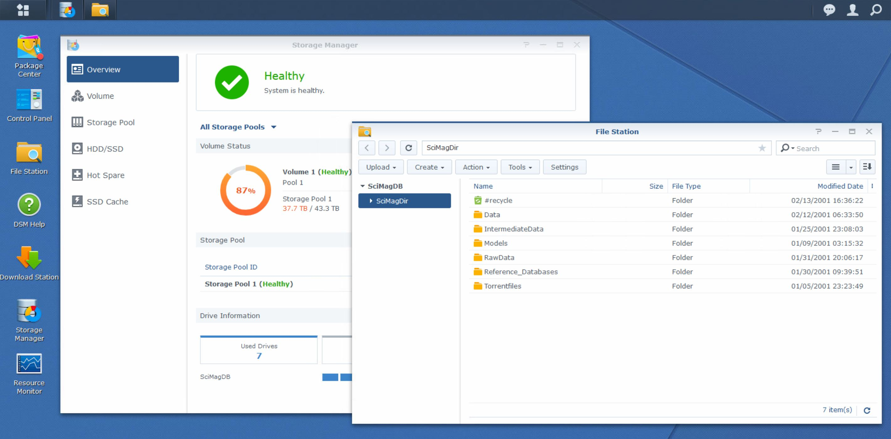

# Data Storage with a Synology NAS

Data storage has never been cheaper and more accessible than now, so why even bother with managing your own data storage soulution and hardware? The arguments for and against a selfowned NAS solution have already been discussed in other [sources](https://www.goodcloudstorage.net/cloud-research/nas-vs-cloud-storage/), I therefore want to highlight my own reasoning behind the data storage solution I chose in the context of managing a hughe torrent library.

## Why even use selfowned storage?
If one thinks about trying to process a huge amount of data the go to solutions available today are clear. An arsenal of cloud storage and data processing for your specific need is available through a range of suppliers. So why store data on your own? The reasoning I followed were mainly based on the following points:
- Part of this projects success is it to support a torrent repository. In order to protect the data around and not rely on legal requirements of other parties and countries
- Setting up and solving technical issues around a NAS device was something I lacked and was interested to solve on my own
- Feasability of using customer hardware. I also wante to find out if I am able to handle and process terabytes of data with my computational and storage hardware.
The next few sections show specific solutions or settings around setting up a synology NAS.

## Choosing a NAS
This subsjective guide shows how I went through the buying and expansion process of my NAS solution and should propose some chunks for though around choosing a NAS system. The brand of Synology has been choose simply based on its reputation and wide availability. Also I simply started with a these NAS systems and did not yet run in limitations. But of course there would be hundreds of aspects to compare but this is beyon the scope of these blog posts.

### NAS for testing
The first NAS for testing purposes was a Synology DS118 with a 1 TB harddrive. As mentioned above the brand Synology was chosen based on its widespread use for home storage solutions. The NAS has been evaluated on the following topics:
* Managing hundreds of torrent files
* Managing downloaded data in a simple and accessible manner
* Programmatically interface to the data

All of these points have been successfully implemented with this Synology NAS and the subsequent step was it to just expand the data storage with a new system

### NAS for scaling up and hosting the data
For scaling up I calculated that the whole repository will be around 56 TB (more to it on learning and pitfalls). I got hands on a secondhand DS1813+ offering eight bays. I gradually equipped it with 8 TB harddrives.

### NAS for backup
Backing up the processed data was expected to around the amount of 8 TB. For the transfer from one Synology NAS system to the other a remote mount (File Station > Tools > Mount remote folder) was set up based on the CIFS file protocols. An example configuration is given in the picture below.

### Learnings and pitfalls
- I was not aware of the different RAID configuration of a multi disk NAS. I therefore went with the standard Synology hybrid raid (SHR). After inserting the second 8TB the storage did not expand as expected. After some googling was clear the the SHR configuration uses one harddrive as backup drive and therfore needs a third drive for the first expansion of the total volume.
- Only go with one type of HD size is preferred. There comes a lot of additional complexity when working with different sized HDs. Just stick with one size makes it a lot easier.
- Besides not having estimated the total amount total amount of data which will downloaded and seeded I simply did not calculate the overhead through intermediary files for data processing. Now once I started equipping the system with 8 TB drives one can not simply add higher storage drives, of course this depends on RAID configuration. But in my case I realized it to late and now can only seed a portion of the whole torrent library.

## Interfaces to the Synology NAS
A Synology NAS offers a wide range of possibilities in order to interface with applications and of course the data stored on the system. Also depending on the programming envrionment different ways of mounting the network storage are used. The following approaches are explained below:
- Web application of the synology
- SSH
- Network directory in Windows for Python (Anaconda)
- Mounted directory in WSL (ubuntu)

### Synology web application

After setting up the Synology NAS one get access to the web interface by default. The web app enables the navigation of data, changing of NAS settings and installation of a wide range of apps from the synology package center. I want to highlight here the most used applications and also show important setting enabling further interfaces

* File Station

    This app is installed by default and is the equivalent to the windows explorer allowing the navigation thorugh files and folders. The advanced search funcitonality has been especially helpful through allowing search on a customized set of folder in order clean up specific files.

* Storage Manager

    Also by default one has to work with the sotrage manager in order to add and manager new hard drives. Also a good status overview on storage usage is given

* Download Station
    The go to tool for managing downloads to the NAS and offers a superb way of managing hundreds of torrent files. Especially to highlight here is that the the destination of each download and corresponding extraction of compressed files in another destination can be set up.

* Control panel - SSH access
    Offers of course a wide range of settings which are beyond this article. But its worth mentioning that the SSH access can be enabled in this app (Control Panel -> Terminal & SNP -> tick "Enable SSH service)

### SSH

* SSH offers a simple way in order to access the the linux OS running on synology through the commandline. It is imporatant not note here that synology runs a very slim [Debian](https://www.reddit.com/r/synology/comments/cn9qnd/what_distribution_of_linux_is_synology_using/) fork and is also highly customized and therefore lacks common libraries and binaries. Nonetheless being able to run some commands fast and direct on the Synology NAS can be helpful. After enabling SSH (see above) the following can executed for example in WSL

        ssh <user name>@<IP of synology> -p22

### Network directory in Windows for Python

One of the most conenvient interfaces of accessing data is through an explorer and in this case through the windows explorer. Having the Synology NAS connected through mapping as a network drive not only makes it available as easy accessible harddrive but also to application running on windows. So can one for example easily manipulate data through a Windows Python installation without having to mount any network drives in the code.

### Mounted directory in WSL (Ubuntu)

If further want to show how to access the Synology NAS through a Unix distro (Ubuntu with WSL on Windows). Once the network drive is mapped as show above it can be mounted in the Unix shell of your choice through this command:

    "<sudo password>" | sudo -S -k mount -t drvfs '\\SciMagDB\SciMagDir' /mnt/share

